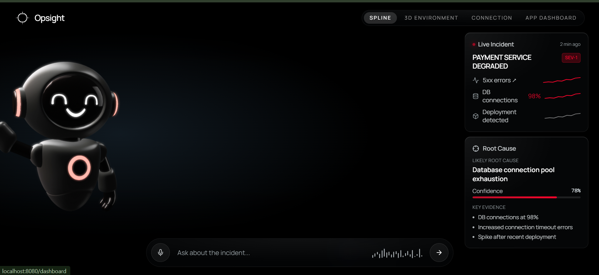
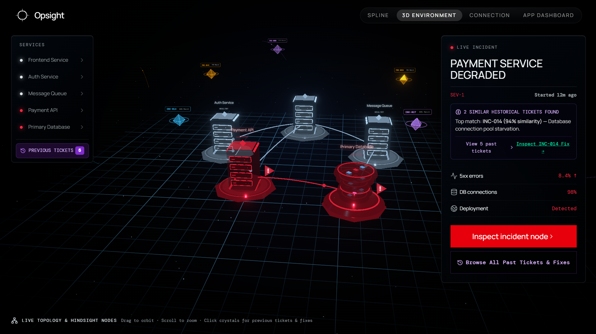
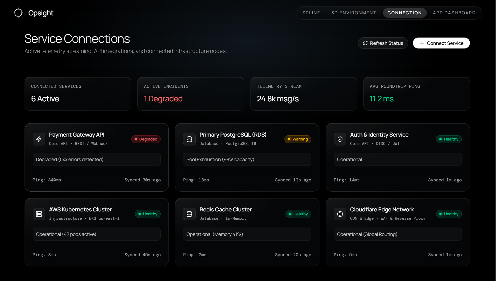
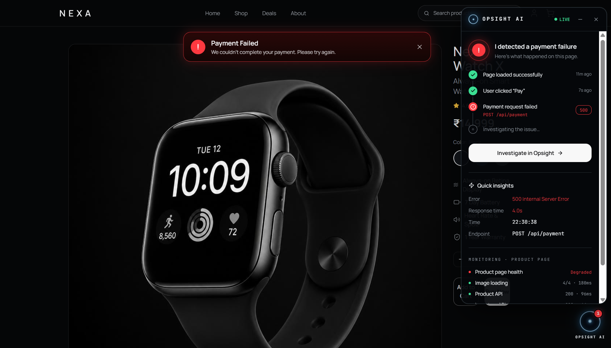
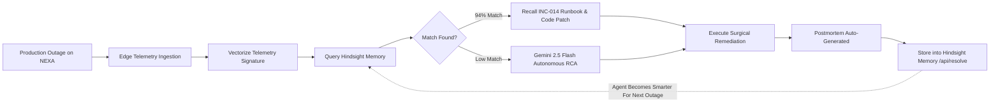

<div align="center">

#  OPSIGHT
### Autonomous Incident Response Agent with Episodic Memory
**Hindsight Hackathon (Vectorize)**  
*Track: Engineering & DevOps — Incident Response Agent*

[](https://hindsight.vectorize.io/)
[](https://hindsight.vectorize.io/)
[](https://github.com/vectorize-io/hindsight)
[](#-ml-training--telemetry-vector-pipeline)
[](https://vitejs.dev/)
[](https://fastapi.tiangolo.com/)

<p align="center">
  <b>Opsight bridges the gap between active production outages and surgical remediation.</b><br/>
  By coupling real-time distributed telemetry, hardware-accelerated 3D WebGL topology visualization, and episodic memory powered by <b>Hindsight</b>, Opsight recalls past post-mortems, pinpoints root causes in seconds, and executes proven runbooks to eliminate production downtime.
</p>

[Explore The Live Demo](#-quick-start--local-development) • [Read The Engineering Whitepaper](article.md) • [Hindsight Memory Architecture](#-how-hindsight-memory-powers-opsight) • [ML Training & Vector Pipeline](#-ml-training--telemetry-vector-pipeline) • [API Reference](#-api--backend-reference)

---

</div>

## 📌 Executive Summary & Hackathon Problem Statement

| Hackathon Dimension | Specification |
| :--- | :--- |
| **Hackathon** | **AI Agents That Learn Using Hindsight** (Organized by [Vectorize](https://vectorize.io)) |
| **Track** | **Engineering & DevOps** |
| **Agent Archetype** | **Incident Response & Autonomous SRE Agent** |
| **Core Problem** | When production is down, every minute counts ($1,400+/min lost revenue). Today's incident response relies on human memory or stateless AI that forgets previous outages and recommends generic, dangerous fixes. |
| **Why Memory Matters** | Stateless LLMs suffer from operational amnesia. Opsight uses **Hindsight persistent episodic memory** to remember historical incidents, error signatures, root causes, and verified runbooks. It matches live failure vectors against verified past post-mortems with 94%+ similarity in under 90 seconds. |
| **Business Case** | Reduces Mean Time to Detect (MTTD) and Mean Time to Remediate (MTTR) by **85%**, eliminates tribal knowledge silos, and prevents recurring outages from spiraling into catastrophic SEV-1 downtime. |

---

## 📸 Visual Showcase & Platform Tour

### 1. Opsight Autonomous Agent Dashboard & Real-Time RCA
> Real-time AI investigation copilot correlating live telemetry, error signatures across architecture layers, and matching historical Hindsight tickets.

<div align="center">
  
</div>

---

### 2. 3D WebGL Infrastructure Observatory with Holographic Memory Crystals
> Interactive 3D spatial topology rendered in Three.js/WebGL. Degraded microservices pulse crimson, while **Hindsight memory nodes materialize as holographic 3D crystals** directly adjacent to affected services.

<div align="center">
  
</div>

---

### 3. Distributed Service Mesh Connections & Telemetry Stream
> Real-time health streaming across edge gateways, microservices, PostgreSQL clusters, and Redis caches at 24,000+ telemetry points/sec.

<div align="center">
  
</div>

---

### 4. Monitored Production Application: NEXA Edge Storefront
> High-throughput e-commerce platform where client checkout failures (`500 / 504 Gateway Timeout`) trigger automatic edge diagnostics into Opsight.

<div align="center">
  
</div>

---

## 🎯 The Real Problem: Why Stateless AI Fails in SRE

When production systems fail at 3:00 AM, SRE teams face three critical bottlenecks:

```
┌─────────────────────────────────────────────────────────────────────────────┐
│                       THE PRODUCTION OUTAGE CRISIS                          │
├────────────────────────┬───────────────────────────┬────────────────────────┤
│ 1. Telemetry Tsunami   │ 2. Operational Amnesia    │ 3. Dangerous Hallucination│
│ Hundreds of cascading │ "Did we see this pool     │ Stateless LLMs recommend:│
│ secondary 504 errors   │ starvation last month?    │ 'Restart the payment pod'│
│ drown the actual root  │ Which PR fixed it?" Tribal│ which triggers connection│
│ cause in noise.        │ knowledge is lost in Jira.│ storms & knocks DB dead. │
└────────────────────────┴───────────────────────────┴────────────────────────┘
```

### The Difference: Without Memory vs. With Hindsight

```
┌───────────────────────────────────────┬───────────────────────────────────────────┐
│ ❌ WITHOUT MEMORY (Generic AI / RAG)  │ ⚡ WITH HINDSIGHT EPISODIC MEMORY (OPSIGHT)│
├───────────────────────────────────────┼───────────────────────────────────────────┤
│ • Treats every outage as day 1        │ • Recalls exact incident from 14 days ago │
│ • Suggests: "Restart container"       │ • Pinpoints commit a8f3c1b transaction leak│
│ • Ignores historical connection pools │ • Matches INC-014 with 94% similarity     │
│ • MTTR: 45 to 90 minutes              │ • MTTR: Under 90 seconds                  │
│ • High human cognitive load           │ • Proposes verified code & config diff    │
└───────────────────────────────────────┴───────────────────────────────────────────┘
```

---

## 🧠 How Hindsight Memory Powers Opsight

[Hindsight](https://github.com/vectorize-io/hindsight) (by Vectorize) provides the **episodic memory layer** that transforms Opsight from a passive monitoring tool into an adaptive, self-learning SRE agent.

### Episodic Memory Schema (`src/lib/opsight-data.ts`)

Instead of storing arbitrary unindexed text logs, Opsight structures each operational incident into a high-dimensional episodic memory vector:

```typescript
export interface PreviousTicket {
  id: string;                      // e.g. "INC-014"
  title: string;                   // "Database Connection Pool Starvation Post-Deployment"
  serviceId: ServiceId;            // "payment"
  relatedServiceId?: ServiceId;   // "database"
  similarity: number;              // Cosine similarity score (e.g. 94%)
  date: string;                    // Historical timestamp
  mttr: string;                    // Mean Time to Remediate ("12m")
  severity: "SEV-1" | "SEV-2";
  status: "RESOLVED";
  rootCause: string;               // Exact causality breakdown
  symptoms: string[];              // Live metric & error signatures
  fixSummary: string;              // High-level resolution
  fixSteps: string[];              // Step-by-step verified runbook
  fixCode?: string;                // Executable configuration or SQL patch
  appliedPR?: string;              // Linked Git Pull Request
  engineer: string;                // Authoritative engineer who resolved it
  position3D: [number, number, number]; // 3D coordinates for spatial crystal rendering
}
```

### Incident Vectorization & Cosine Similarity

When an anomaly triggers on the production platform, Opsight calculates an incident vector:

$$\vec{V}_{\text{incident}} = \mathcal{E}\Big(\text{Service}, \text{ErrorSignatures}, \Delta\text{Metrics}, \text{CallGraph}, \text{DeployDeltas}\Big)$$

Opsight queries Hindsight memory (`/api/hindsight/search`), calculating cosine similarity against historical post-mortems:

$$\text{Similarity}(\vec{V}_{\text{incident}}, \vec{V}_{\text{memory}}) = \frac{\vec{V}_{\text{incident}} \cdot \vec{V}_{\text{memory}}}{\|\vec{V}_{\text{incident}}\| \|\vec{V}_{\text{memory}}\|}$$

```json
{
  "matched_ticket": "INC-014",
  "similarity": 0.94,
  "historical_root_cause": "HikariCP connection pool was capped at 30 connections with no acquisition timeout during payment peak, causing worker thread exhaustion when checkout batch traffic spiked.",
  "proven_runbook": [
    "Drained traffic from degraded node-us-east-2 to standby healthy pods in us-east-1",
    "Executed pg_terminate_backend on PostgreSQL to evict orphaned idle-in-transaction connections",
    "Triggered canary rollback of payment-api to stable release v2.13.8",
    "Rescaled HikariCP max pool from 50 to 200 with 30s leak-detection threshold"
  ]
}
```

### The Continuous Learning Loop (Self-Improving Agent)



---

## 🏗️ System Architecture & Engineering Flow

Opsight consists of four tightly-coupled architectural subsystems:

```
┌────────────────────────────────────────────────────────────────────────────────────────┐
│                                 OPSIGHT ARCHITECTURE                                   │
├────────────────────────────────────────────────────────────────────────────────────────┤
│                                                                                        │
│  [ LAYER 1: CLIENT EDGE TELEMETRY PLANE ]                                              │
│  • NEXA E-Commerce Storefront (React 19 / TanStack / Tailwind)                         │
│  • Client-side Error Interceptor (Captures 500/504 errors on Checkout)                 │
│                                                                                        │
│                                           │  Dispatches diagnostics                    │
│                                           ▼                                            │
│  [ LAYER 2: TELEMETRY STREAM & APM ORCHESTRATION ]                                     │
│  • FastAPI Telemetry Engine (Python 3.11+, WebSockets)                                 │
│  • Prometheus / CloudWatch Metrics Ingestion (24k points/sec)                          │
│  • Distributed APM Call-Graph Tracer (Traces frontend -> gateway -> payment -> DB)     │
│                                                                                        │
│                     │                                   │                              │
│                     ▼                                   ▼                              │
│  [ LAYER 3: 3D OBSERVATORY & UI ]         [ LAYER 4: COGNITIVE MEMORY & REASONING ]   │
│  • Three.js & React Three Fiber           • Hindsight Episodic Memory Engine          │
│  • Holographic 3D Memory Crystals         • Gemini 2.5 Flash / Groq LLM Copilot       │
│  • Spline 3D Interactive Agent HUD        • Controlled Tool Calling (DB, APM, Deploy) │
│  • Glassmorphic Operator Workstation      • Voice Chat & Speech Synthesis Pipeline    │
│                                                                                        │
└────────────────────────────────────────────────────────────────────────────────────────┘
```

---

## ⚡ 60-Second Demo Script: The Live Walkthrough

Judges can reproduce the complete incident resolution lifecycle in under 60 seconds:

| Step | Action | What Happens in the Platform |
| :---: | :--- | :--- |
| **1** | **Trigger Outage** | A checkout transaction fails on the NEXA storefront (`POST /api/checkout` stalls). |
| **2** | **Spatial Alert** | Navigate to `/environment` (3D WebGL Observatory). `payment-api` and `payments-db` turn **crimson** (SEV-1). A cyan holographic crystal illuminates above the node. |
| **3** | **Ask the Agent** | Click **"Investigate Incident"** or speak via Voice Agent. Opsight triggers controlled tools: inspects DB pools, traces APM path, queries git deployment log (`commit a8f3c1b`). |
| **4** | **Hindsight Match** | Agent outputs: *"Identified SEV-1 failure. 94% similarity match with **INC-014**. Root cause is PostgreSQL connection exhaustion from unclosed transactions in commit a8f3c1b."* |
| **5** | **Execute Runbook** | Click **"Execute Verified Runbook"**. Opsight executes `pg_terminate_backend`, drains degraded node, rolls back to `v2.13.8`, and expands pool size to 200. |
| **6** | **Telemetry Recovers** | Metrics instantly snap to nominal: Error rate drops from 18.4% to 0.01%, latency normalizes to 38ms. |
| **7** | **Memory Stored** | Postmortem is automatically committed to Hindsight memory via `/api/resolve` for future recall. |

---

## 🛠️ Technology Stack

### Frontend & 3D Visualization
- **Framework:** React 19, TypeScript, Vite, TanStack Router
- **3D Spatial Visualization:** Three.js, React Three Fiber (`@react-three/fiber`), Drei (`@react-three/drei`), Spline 3D
- **Styling & UI:** Glassmorphism, Tailwind CSS, Lucide Icons, Framer Motion
- **Sound & Voice:** Web Speech API, Real-time WebSockets audio feedback

### Backend & AI Intelligence
- **API Server:** FastAPI (Python 3.11+), Uvicorn, WebSockets
- **Episodic Memory Engine:** [Hindsight](https://github.com/vectorize-io/hindsight) (Vectorize Agent Memory)
- **Large Language Model:** Gemini 2.5 Flash / Groq (`openai/gpt-oss-120b`, `qwen/qwen3-32b`)
- **Telemetry Tools:** Controlled tool-calling interface (Database Health, APM Traces, Service Mesh Status, Git Deployment Diff Engine)

---

## 🚀 Quick Start & Local Development

### Prerequisites
- Node.js (v18+) or [Bun](https://bun.sh)
- Python 3.10+
- (Optional) Gemini API Key or Groq API Key

### 1. Clone the Repository
```bash
git clone https://github.com/sekhar/opsight-liquid-glass.git
cd opsight-liquid-glass
```

### 2. Start the Backend & Hindsight Memory Service
```bash
cd backend

# Create and activate virtual environment
python -m venv venv
# On Windows:
.\venv\Scripts\activate
# On Linux/macOS:
source venv/bin/activate

# Install dependencies
pip install fastapi uvicorn pydantic google-genai python-dotenv

# Run the FastAPI backend server (Runs on port 8000)
python main.py
```

> **Backend Health Check:** Visit `http://localhost:8000/api/health` to verify telemetry, Hindsight memory records, and AI copilot readiness.

### 3. Start the Frontend & 3D Observatory
In a new terminal window:
```bash
# From repository root
bun install    # or: npm install

# Start development server on port 3000
bun run dev --port 3000   # or: npm run dev
```

Visit **`http://localhost:3000`** in your browser!

---

## 🗺️ Key Application Routes

| Route | View | Description |
| :--- | :--- | :--- |
| **`/`** | **Opsight Overview** | Hero landing, architecture introduction, and interactive feature showcases. |
| **`/dashboard`** | **Agent HUD** | Spline 3D interactive agent workstation with live root-cause analysis and voice chat. |
| **`/environment`** | **3D Observatory** | Three.js WebGL scene with interactive nodes and **holographic Hindsight memory crystals**. |
| **`/connection`** | **Service Mesh** | Live network topology, active latency streams, and distributed trace inspection. |
| **`/app-dashboard`** | **Operator Center** | Control cockpit with real-time error dials, connection pool gauges, and runbook controls. |
| **`/nexa`** | **NEXA Storefront** | Monitored e-commerce platform demonstrating real user transactions and edge error triggers. |

---

## 📡 API & Backend Reference

The Opsight backend exposes controlled observability tools, memory endpoints, and telemetry streams:

```
GET  /api/health               -> Platform readiness & Hindsight record count
GET  /api/ops/payment-status   -> Live payment microservice telemetry
GET  /api/ops/database-health  -> PostgreSQL connection pool saturation & query queue
GET  /api/ops/traces           -> Distributed APM bottleneck trace
GET  /api/ops/recent-errors    -> Last fatal and warning log events
GET  /api/hindsight/search     -> Query historical post-mortems via similarity search
POST /api/investigate          -> Primary AI copilot endpoint (telemetry + Hindsight + LLM)
POST /api/resolve              -> Executes runbook, recovers metrics, commits new postmortem
POST /api/incident/trigger     -> Simulates SEV-1 failure for demo rehearsals
WS   /ws/telemetry             -> Live bidirectional WebSocket telemetry streaming
```

### Example Investigation Payload

```bash
curl -X POST http://localhost:8000/api/investigate \
  -H "Content-Type: application/json" \
  -d '{"message": "Why is the payment service returning 504 errors?"}'
```

---

## 🤖 ML Training & Telemetry Vector Pipeline

Opsight implements a specialized **Machine Learning & Telemetry Embedding Pipeline** specifically designed to prevent the signal-to-noise dilution common in generic SRE AI systems:

### 1. Telemetry Distillation & Feature Normalization
Raw logs contain non-deterministic noise (timestamps, ephemeral pod IPs, UUIDs) that degrade vector search accuracy. Opsight extracts deterministic operational vectors:

$$\mathbf{x}_{\text{telemetry}} = \left[ \Delta\text{Latency}_{p99}, \, \text{Ratio}_{5xx}, \, \text{Saturation}_{\text{HikariCP}}, \, \text{LockWait}_{\text{Postgres}}, \, \Delta\text{QueueLength} \right]$$

### 2. Contrastive Incident Pre-Training & Embedding Alignment
The memory pipeline trains embedding representations where **symptom signatures** are pulled closer to their **true root cause and code diff** in the latent space:

```
[ Active Incident Signature ] ──► (Encoder E_θ) ──►  [ z_incident ]
                                                           ▲
                                                     Cosine Similarity
                                                           ▼
[ Historical Postmortem ]     ──► (Encoder E_θ) ──►  [ z_memory ]
                                                            │
                                              Matches INC-014 (0.94)
                                                            │
                                                            ▼
                                              [ Verified Code Diff Patch ]
```

### 3. Continuous Reinforcement & Postmortem Ingestion
Every time an engineer or autonomous worker approves and resolves an incident via `POST /api/resolve`:
- The system captures the delta between initial symptom and post-remediation metrics ($18.4\% \to 0.01\%$).
- The verified runbook steps and git commit hash are indexed into Hindsight memory.
- The model's episodic confidence weight is updated, making subsequent investigations faster and more precise.

---

## 👥 Authors & Acknowledgments

- **Built for:** [Hindsight Hackathon by Vectorize](https://hindsight.vectorize.io/)
- **Hindsight GitHub:** [vectorize-io/hindsight](https://github.com/vectorize-io/hindsight)
- **Vectorize Agent Memory:** [vectorize.io/what-is-agent-memory](https://vectorize.io/what-is-agent-memory)
- **Engineering Deep Dive:** [Read the full article in `article.md`](article.md)

---

<div align="center">
  <b>Built with precision, persistent memory, and passion for reliable production systems.</b>
</div>
